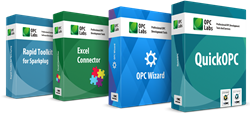

## Welcome 👋

The Connectivity Software is a suite of software development components, tools and applications. It works on .NET, COM and Python platforms, and consists of following products:
* **[QuickOPC](https://github.com/OPCLabs/QuickOPC) (OPC client and subscriber development)**
* Excel Connector ([OPC and Excel integration](https://www.opclabs.com/products/excel-connector))
* **[OPC Wizard](https://github.com/OPCLabs/OPCWizard) (OPC server toolkit)**
* [Rapid Toolkit for Sparkplug](https://github.com/OPCLabs/EasySparkplug) (Sparkplug development)

Connectivity Software products are commercially licensed. Some of the [tools are free](https://kb.opclabs.com/Tool_Downloads), 
and all functionality is available in free trial mode, which provides valid data for 30 minutes; after that period, 
the application needs to be re-started, and so on. You must also comply with licensing terms for 3rd-party material 
redistributed with Connectivity Software. 

[User's Guide and Reference](https://www.opclabs.com/documentation) | 
[Send Feedback](mailto:DevDocs@opclabs.com) | 
Resources: [Knowledge Base](https://kb.opclabs.com), [Product Downloads](https://www.opclabs.com/download) |
Technical support: [Online Forums](https://www.opclabs.com/forum/index), [FAQ](https://www.opclabs.com/support/frequently-asked-questions)

Examples on GitHub: 
[C#](https://github.com/OPCLabs/Examples-ConnectivityStudio-CSharp) |
[Object Pascal (Delphi)](https://github.com/OPCLabs/Examples-ConnectivityStudio-OP) |
[PHP](https://github.com/OPCLabs/Examples-ConnectivityStudio-PHP) |
[PowerShell](https://github.com/OPCLabs/Examples-ConnectivityStudio-PowerShell) |
[Python](https://github.com/OPCLabs/Examples-ConnectivityStudio-Python) |
[VB.NET](https://github.com/OPCLabs/Examples-ConnectivityStudio-VBNET) |
[VB6](https://github.com/OPCLabs/Examples-ConnectivityStudio-VB) |
[VBScript](https://github.com/OPCLabs/Examples-ConnectivityStudio-VBScript)

Examples in more languages and tools, such as C++, Free Pascal (Lazarus), Perl, JScript, PowerScript (PowerBasic), REALBasic (Xojo), Visual FoxPro, or XBase++ are installed with the [Setup program](https:///www.opclabs.com/download).

Follow us on [X (Twitter)](https://x.com/opclabs) | Follow us on [LinkedIn](https://linkedin.com/company/opc-labs)

<!--
**OPCLabs/OPCLabs** is a ✨ _special_ ✨ repository because its `README.md` (this file) appears on your GitHub profile.

Here are some ideas to get you started:

- 🔭 I’m currently working on ...
- 🌱 I’m currently learning ...
- 👯 I’m looking to collaborate on ...
- 🤔 I’m looking for help with ...
- 💬 Ask me about ...
- 📫 How to reach me: ...
- 😄 Pronouns: ...
- ⚡ Fun fact: ...
-->
